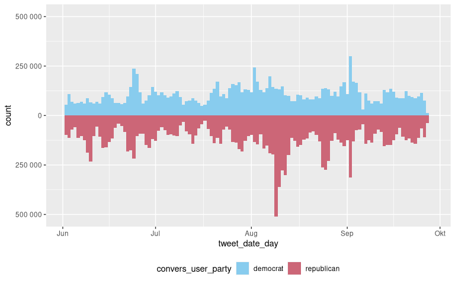

# get_replies_delegates

## Overview

Scripts that can be used to collect all Twitter coversations started by
members of the US congress. The replies are collected via the [standard
search (Version
1.1)](https://developer.twitter.com/en/docs/twitter-api/v1/tweets/search/api-reference/get-search-tweets)
API endpoint. As my access to historical data through this API enpoint
is limited to the past \~7 days, the script has to be executed
repeatedly.

## …

``` r

library(tidyverse)
library(DBI)

dir_data <- "~/Documents/get_tweets/data"

tweets_db <- dbConnect(
  drv=RSQLite::SQLite(), 
  dbname=fs::path(dir_data, "tweets", ext="db"),
  extended_types=TRUE
)

dbListTables(tweets_db)
#> [1] "delegates_info"      "tweets_clean"        "tweets_clean_pruned"
#> [4] "tweets_raw"
```

``` r

tbl(tweets_db, "tweets_raw")
#> # Source:   table<tweets_raw> [?? x 26]
#> # Database: sqlite 3.39.1 [/mnt/21f3fcbc-9669-4c84-afae-5205d7a138ad/Documents/get_tweets/data/tweets.db]
#>   tweet_st…¹ tweet…² tweet…³ tweet…⁴ tweet…⁵ tweet…⁶ tweet_created_at    tweet…⁷
#>      <int64> <int64> <chr>     <int>   <int> <chr>   <dttm>              <chr>  
#> 1       1e18    1e18 AlexPa…  8.25e7  8.25e7 AlexPa… 2022-05-25 16:41:20 en     
#> 2       1e18    1e18 AlexPa…  8.25e7  8.25e7 AlexPa… 2022-05-24 19:54:37 en     
#> 3       1e18    1e18 AlexPa…  8.25e7  8.25e7 AlexPa… 2022-05-24 16:41:31 en     
#> 4       1e18    1e18 AlexPa…  8.25e7  8.25e7 AlexPa… 2022-05-24 01:05:02 en     
#> 5       1e18    1e18 AlexPa…  8.25e7  8.25e7 AlexPa… 2022-05-23 21:30:05 en     
#> # … with more rows, 18 more variables: tweet_text <chr>,
#> #   tweet_reply_to_status_id <int>, tweet_reply_to_user_id <int>,
#> #   tweet_reply_to_user_screen_name <chr>, tweet_retweet_status_id <int>,
#> #   tweet_retweet_created_at <dttm>, tweet_retweet_user_id <int>,
#> #   tweet_retweet_user_screen_name <chr>, tweet_quote_status_id <int>,
#> #   tweet_quote_created_at <dttm>, tweet_quote_user_id <int>,
#> #   tweet_quote_user_screen_name <chr>, tweet_quote_text <chr>, …

# Number of rows
pull(tally(tbl(tweets_db, "tweets_raw")), n)
#> [1] 22903500
```

``` r

tweets_count <- local({
  
  .tweets_count_chunk_size <- 1e6L
  
  .tweets_count_statement <- str_c(
    "SELECT `tweet_convers_user_screen_name`, `tweet_created_at` ",
    "FROM `tweets_raw`"
  )
  
  .tweets_count <- tibble()
  
  .tweets_count_query <- DBI::dbSendQuery(
    conn=tweets_db, statement=.tweets_count_statement
  )
  
  repeat{
    
    .chunk_raw <- dbFetch(res=.tweets_count_query, n=.tweets_count_chunk_size)
    
    if(nrow(.chunk_raw) == 0){break()}
    
    .tweets_count <- 
      .chunk_raw %>% 
      count(
        tweet_convers_user_screen_name,
        tweet_created_at_day = lubridate::as_date(tweet_created_at), 
        name="count"
      ) %>% 
      bind_rows(.tweets_count) %>% 
      group_by(across(-count)) %>% 
      summarize(across(count, sum), .groups="drop")
    
    gc()
    
  }
  
  dbClearResult(.tweets_count_query)
  
  .delegates_info <- 
    tbl(tweets_db, "delegates_info") %>% 
    select(
      tweet_convers_user_screen_name, 
      tweet_convers_user_party = party,
      tweet_convers_user_role = role
    ) %>% 
    collect()
  
  .tweets_count <- left_join(
    .tweets_count, .delegates_info, by="tweet_convers_user_screen_name"
  )
  
  return(.tweets_count)
  
})

tweets_count %>% 
  group_by(tweet_convers_user_party, tweet_created_at_day) %>% 
  summarise(across(count, sum), .groups="drop") %>% 
  mutate(count = modify_if(
    as.double(count), tweet_convers_user_party != "democrats", `*`, -1
  )) %>% 
  filter(tweet_created_at_day > lubridate::ymd("2022-06-01")) %>% 
  ggplot(
    aes(x=tweet_created_at_day, y=count, fill=tweet_convers_user_party)
  ) + 
  geom_col(width=1) +
  scale_y_continuous(labels=function(.b){scales::number(abs(.b))}) +
  rcartocolor::scale_fill_carto_d(palette="Safe") +
  theme(legend.position="bottom")
```


